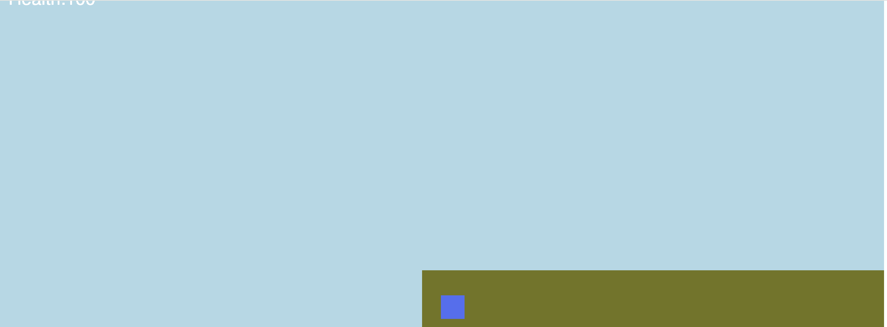

# Entry 3
##### 2/5/2024

### Content
I've been slowly learning new concepts and creating a game which will probably be my mvp. Doing things such as updating text or doing checks can not be just put somewhere random in the code. I realized that since the code executes top-down, by the time the game loads, all functions and checks are already performed. Which means I couldn't just write an if statement somewhere to update something like the health text whenever it goes down.

I reazlied that I had to put a lot of checks and updates in the `onUpdate(()=>{ })` function. The function will execute everything inside every frame. Kaboom runs at 60 fps, so the code inside will run 60 times a second.

During this time, I had also found out that Kaboom.js had a [Discord server](https://discord.com/invite/aQ6RuQm3TF) and there are channels where you could ask questions or help about anything related the framework.


I learned how to create health in kaboom with variables and display it in text.
```js
let playerHealth = 100
const hpBar = add([
    text(`Health:${playerHealth}`, {size: 24,}),
    pos(player.pos.x-590, player.pos.y-400),
    { value: health },
])
```
The player you move around will have 100 health points and there is a text at the top left of the screen displaying your health. I used `onUpdate(()=>{ })` to update the health text whenever it updates
```js
onUpdate(() => {
    hpBar.text = `Health:${playerHealth}`
})
```
An issue with the `text()` function was it was considered a sprite inside the game. Whenever the camera moves, the health text would be in the same place of the game, instead of being fixed to somewhere in the screen

I did not find any other methods to create text so for now, I used `onUpdate(()=>{ })` to update the text location relative to the player. Whenever the player moves, the text would move as well but it would appear to be fixed to somewhere
```js
onUpdate(() => {
    hpBar.text = `Health:${playerHealth}`
    hpBar.pos.x = player.pos.x-590
    hpBar.pos.y = player.pos.y-400
})
```
This should always update the text location so it would always be in the top-left part of the screen to the player(camera is focused on).

During feburary break, I will be learning how to create and use scenes so I could make a death and maybe a start menu.


[Previous](entry02.md) | [Next](entry04.md)

[Home](../README.md)